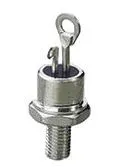

# Thyristors

  

    
  

  Thyristor

This notebook provides an overview of thyristors, including their definition, characteristic curve, operation, types, applications, and advantages.

## Author Information

**Name:** Abolfazl Jahangir  
**Affiliation:** Department of Computer Engineering, Ferdowsi University of Mashhad  
**Contact:** jahangirabolfazl6@gmail.com

## What is a Thyristor?

A **thyristor** is a solid-state semiconductor device that acts as a bistable switch, conducting when its gate receives a current trigger and continuing to conduct while the voltage across the device is forward-biased. They are primarily used in industrial settings for controlling high voltages and currents. The term 'thyristor' combines 'thyratron' (a gas-filled tube) and 'transistor'.

## Applications of Thyristors

  

    
  

  Thyristor Application

Thyristors are used in various applications, including:

- **Motor Speed Control:** Regulating the speed of electric motors.
- **Light Dimming:** Adjusting brightness in lighting systems.
- **Pressure and Liquid Level Control:** In industrial process controls.
- **Inverter and Converter Circuits:** Converting AC to DC and vice versa.

## Why do we use Thyristor?

Let's answer this using an application of the thyristor, **Motor Speed Control**!

The single thyristor used in a half-wave-controlled rectifier is connected in series with the load. The thyristor conducts when it is activated at a certain firing angle during the positive half-cycle of the input AC supply. The firing angle and the input AC voltage amplitude determine the output voltage waveform. The amount of power supplied to the load can be regulated by varying the firing angle, which also influences the average output voltage. The drawback of half-wave-controlled rectifiers is that they only use half of the AC waveform that is input. Average voltage applied to the motor would be:

$$ V_{avg} = \frac{V_{m}}{2\pi}(1 + \cos\alpha) $$

- $ V_{m} $ = Peak AC voltage
- $ \alpha $ = Firing angle

We’ll explore phase-controlling in more detail in the following sections.

## How Does a Thyristor Work?

Thyristors, unlike the junction diode which is a two-layer (P-N) semiconductor device, or the commonly used bipolar transistor which is a three-layer (P-N-P or N-P-N) switching device, are composed of four layers of alternating P-type and N-type semiconductor materials (P-N-P-N structure), forming three PN junctions. They have three terminals: anode, cathode, and gate. When a small current is applied to the gate, the thyristor switches from a non-conductive to a conductive state, allowing current to flow between the anode and cathode. The device remains conducting until the current drops below a certain threshold or is externally interrupted. This P-N-P-N structure image is just a model, not real.

$$ V_{AK} = V_T + I \cdot R_{ON} $$

- $ V_{AK} $ = Anode to Cathode voltage
- $ V_{T} $ = Threshold voltage (~0.7-1.5V for silicon)
- $ R_{ON} $ = On-state resistance

The two-transistor equivalent circuit (in the image above) shows that the collector current of the NPN transistor ${TR}_2$ feeds directly into the base of the PNP transistor ${TR}_1$, while the collector current of ${TR}_1$ feeds into the base of ${TR}_2$. These two interconnected transistors rely upon each other for conduction as each transistor gets its base-emitter current from the other’s collector-emitter current. So until one of the transistors is given some base current, nothing can happen even if an Anode-to-Cathode voltage is present.

## Types of Thyristors

- **Silicon Controlled Rectifier (SCR):** The most common type, used for controlling power in AC and DC systems.
- **Gate Turn-Off Thyristor (GTO):** Can be turned on and off via the gate signal.
- **Triac:** Can conduct in both directions, suitable for AC applications.
- **Diac:** Often used to trigger triacs.
- **Light-Activated SCR (LASCR):** Triggered by light exposure.
- **Reverse Conducting Thyristor (RCT):** Integrates a diode for reverse conduction.

## Characteristic Curve Of Thyristor

The V-I characteristics basically consist of three regions or modes of operation, they are:
- Reverse blocking mode
- Forward blocking mode
- Forward conduction mode

### Reverse Blocking Mode

When the positive terminal of supply is connected to the cathode and the negative terminal is connected to anode with gate circuit open, then SCR operates in the reverse blocking mode. In this mode, junction $J_{1}$ and $J_{3}$ become reverse-biased, whereas junction $J_{2}$ becomes forward-biased.

The reverse-biased junctions ($J_{1}$ and $J_{3}$) act as an open circuit and the forward-biased junction ($J_{2}$) acts as a short circuit, as shown above. It can be seen that the SCR does not conduct any current and it is said to be in the reverse blocking state or OFF state. However, a very small amount of leakage current flows through it.

Now, if we increase the reverse voltage to a value called reverse breakdown voltage, then an avalanche will occur and break the junction $J_{1}$ and $J_{3}$. Due to this, a very huge amount of current flows through the circuit and hence the SCR starts conducting.

But this method of conducting SCR is not recommended as it may damage the SCR or the circuit in which it is working. Hence, we must ensure that the reverse voltage does not exceed the reverse breakdown voltage $V_{BR}$.

### Forward Blocking Mode

In the forward blocking mode of operation of SCR, the anode is connected to the positive terminal, and cathode is connected to the negative terminal of the power source with the gate circuit open. In this mode, the junction $J_{1}$ and $J_{3}$ get forward-biased, whereas the junction $J_{2}$ gets reverse-biased.

The forward-biased junctions ($J_{1}$ and $J_{3}$) act as a short circuit, whereas the reverse-biased junction $J_{2}$ acts as an open circuit, as shown in the above figure. Even in this mode, the SCR does not conduct any current except a very small value of leakage current. This mode of operation of SCR is called forward blocking mode and it is the most widely operated mode.

Just as in the reverse blocking mode, the SCR can be made to conduct in the forward blocking mode by increasing the anode-cathode voltage to a value called forward breakdown voltage $V_{BO}$. Even this method is also not recommended as it may also damage the SCR. Hence, the SCR does not conduct even in this mode and is treated as an open switch.

### Forward Conducting Mode

In the forward conduction mode of SCR, the anode is connected to the positive terminal and the cathode is connected to the negative terminal with the gate circuit closed (i.e., application of small gate voltage). In this mode, all three junctions ($J_{1}$, $J_{2}$, and $J_{3}$) act as a short circuit, as shown in the figure below, and hence the SCR conducts current.

This method of conducting the SCR is most efficient, as it requires a voltage that is very much less than $V_{BO}$. The only extra thing we require is a gate signal for a small period of time for which the anode current becomes equal to the latching current. The minimum value of anode current is compulsory in order to maintain conduction.

Once the anode current attains this value, the gate loses control and hence can be removed. The removal of the gate signal will not have any effect on the SCR conduction.

However, if the anode current decreases to a value called holding current, the SCR will once again go back to the forward blocking state. Hence, care must be taken that the anode current should not drop below the holding current after the gate signal is removed.

## Important Terms Related to V-I Characteristics of SCR

### Forward Breakdown Voltage $V_{BO}$

It is the voltage above which the SCR starts conducting, i.e., ON state. The forward breakdown voltage depends upon gate current. The typical value of $V_{BO}$ lies between 50V to 2500V.

### Latching Current $I_{L}$

Latching current is defined as the minimum value of current above which the anode current should rise for the reliable turn ON of the SCR. The width of the gate pulse should be so chosen that the anode current rises above the latching current $I_{L}$.

In other words, for the proper turn ON of SCR, the anode current must build up rapidly such that the latching current of SCR is reached before the removal of the gate pulse.

### Holding Current $I_{H}$

Holding current is the minimum value of anode current below which the SCR will be in an OFF state. For an anode current of $I_{H}$ and above $I_{H}$, it holds the SCR in ON state. It is useful to decide the instant for the application of the reverse voltage to completely turn OFF the SCR.

Usually, the holding current value is less than the latching current value (i.e., $I_{H}$ < $I_{L}$). The holding current of an SCR is associated with the turn OFF process, while the latching current is associated with the turn ON process.

### Reverse Breakdown Voltage $V_{BR}$

The reverse voltage above which the breakdown of SCR takes place, i.e., the breakdown of junctions $J_{1}$ and $J_{3}$. It is also called the avalanche breakdown voltage. The $V_{BR}$ is less than the $V_{BO}$ with a typical value of a few kilovolts.

## How to turn off the thyristor?

Once the thyristor has self-latched into its “ON” state and passing a current, it can only be turned “OFF” again by either removing the supply voltage and therefore the Anode ($I_A$) current completely, or by reducing its Anode to Cathode current by some external means (the opening of a switch, for example) to below a value commonly called the “minimum holding current”, $I_H$.

Also, if we want to trigger the gate, this condition should be satisfied:

$$ I_G \geq \frac{V_{GK} - V_{GT}}{R_G} $$

- $ I_G $ = Gate current
- $ V_{GK} $ = Gate-cathode voltage
- $ V_{GT} $ = Gate trigger voltage (~0.5-3V)
- $ R_G $ = Gate resistance

The Anode current must therefore be reduced below this minimum holding level long enough for the thyristor’s internally latched pn-junctions to recover their blocking state before a forward voltage is again applied to the device without it automatically self-conducting. Obviously then, for a thyristor to conduct in the first place, its Anode current, which is also its load current, $I_A$, must be greater than its holding current value. That is $I_A > I_H$.

Since the thyristor has the ability to turn “OFF” whenever the Anode current is reduced below this minimum holding value, it follows then that when used on a sinusoidal AC supply, the SCR will automatically turn itself “OFF” at some value near to the cross-over point of each half cycle, and as we now know, will remain “OFF” until the application of the next Gate trigger pulse.

Since an AC sinusoidal voltage continually reverses in polarity from positive to negative on every half-cycle, this allows the thyristor to turn “OFF” at the ${180}^o$ zero point of the positive waveform. This effect is known as “natural commutation” and is a very important characteristic of the silicon-controlled rectifier.

Thyristors used in circuits fed from DC supplies, this natural commutation condition cannot occur as the DC supply voltage is continuous, so some other way to turn “OFF” the thyristor must be provided at the appropriate time because once triggered it will remain conducting.

However, in AC sinusoidal circuits, natural commutation occurs every half cycle. Then during the positive half cycle of an AC sinusoidal waveform, the thyristor is forward-biased (anode positive) and can be triggered “ON” using a Gate signal or pulse. During the negative half cycle, the Anode becomes negative while the Cathode is positive. The thyristor is reverse-biased by this voltage and cannot conduct even if a Gate signal is present.

So by applying a Gate signal at the appropriate time during the positive half of an AC waveform, the thyristor can be triggered into conduction until the end of the positive half cycle. Thus, phase control (as it is called) can be used to trigger the thyristor at any point along the positive half of the AC waveform, and one of the many uses of a Silicon Controlled Rectifier is in the power control of AC systems as shown.

## Phase Control

Single-phase-controlled rectifiers are grouped into various types based on the converters used to control the output voltage. These categories include semi-converters, dual, full, and series converters.

At the start of each positive half-cycle, the SCR is “OFF”. On the application of the gate pulse, it triggers the SCR into conduction and remains fully latched “ON” for the duration of the positive cycle. If the thyristor is triggered at the beginning of the half-cycle (θ = ${0}^o$), the load (a lamp) will be “ON” for the full positive cycle of the AC waveform (half-wave rectified AC).

As the application of the gate trigger pulse increases along the half cycle (θ = ${0}^o$ to ${90}^o$), the lamp is illuminated for less time, and the average voltage delivered to the lamp will also be proportionally less, reducing its brightness.

Then we can use a silicon-controlled rectifier as an AC light dimmer as well as in a variety of other AC power applications such as: AC motor-speed control (we discussed about it), temperature control systems, and power regulator circuits, etc.

Thus far, we have seen that a thyristor is essentially a half-wave device that conducts in only the positive half of the cycle when the Anode is positive and blocks current flow like a diode when the Anode is negative, irrespective of the Gate signal.

But there are more semiconductor devices available which come under the banner of “Thyristor” that can conduct in both directions, full-wave devices, or can be turned “OFF” by the Gate signal.

Such devices include **Gate Turn-OFF Thyristors (GTO)**, **Static Induction Thyristors (SITH)**, **MOS Controlled Thyristors (MCT)**, **Silicon Controlled Switch (SCS)**, **Triode Thyristors (TRIAC)**, and **Light Activated Thyristors (LASCR)** to name a few, with all these devices available in a variety of voltage and current ratings, making them attractive for use in applications at very high power levels.

## Advantages of Thyristors

- **High Efficiency:** Low power loss during operation.
- **Compact Size:** Suitable for space-constrained applications.
- **High Voltage and Current Handling:** Capable of controlling large power loads.
- **Fast Switching:** Quick response times for turning on and off.
- **Reliability:** Solid-state construction offers durability and long life.

## Thyristor Summary

Silicon Controlled Rectifiers, known commonly as Thyristors, are three-junction P-N-P-N semiconductor devices which can be regarded as two interconnected transistors that can be used in the switching of heavy electrical loads. They can be latched “ON” by a single pulse of positive current applied to their Gate terminal and will remain “ON” indefinitely until the Anode to Cathode current falls below their minimum latching level.

### Static Characteristics of a Thyristor

- Thyristors are semiconductor devices that can operate only in the switching mode.
- Thyristors are current-operated devices; a small Gate current controls a larger Anode current.
- Conducts current only when forward-biased and triggering current applied to the Gate.
- The thyristor acts like a rectifying diode once it is triggered “ON”.
- Anode current must be greater than holding current to maintain conduction.
- Blocks current flow when reverse-biased, no matter if Gate current is applied.
- Once triggered “ON”, will be latched “ON” conducting even when a gate current is no longer applied, providing Anode current is above latching current.

Thyristors are high-speed switches that can be used to replace electromechanical relays in many circuits as they have no moving parts, no contact arcing, or suffer from corrosion or dirt. But in addition to simply switching large currents “ON” and “OFF”, thyristors can be made to control the mean value of an AC load current without dissipating large amounts of power. A good example of thyristor power control is in the control of electric lighting, heaters, and motor speed.

## References

- RS Components [A Complete Guide to Thyristors](https://uk.rs-online.com/web/content/discovery/ideas-and-advice/thyristors-guide)
- Electronics Tutorials [Thyristors](https://www.electronics-tutorials.ws/power/thyristor.html)
- Thyristor Physics. Adolph Blicher. 1976
- The Characteristic Curves of the Thyristor. Wolfgang Weiske. 1966-1991
- Electronics Mind [V-I Characteristics of SCR or Thyristor – Modes of Operation](https://electronicsmind.com/v-i-characteristics-of-scr-or-thyristor/)